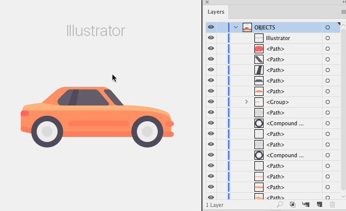
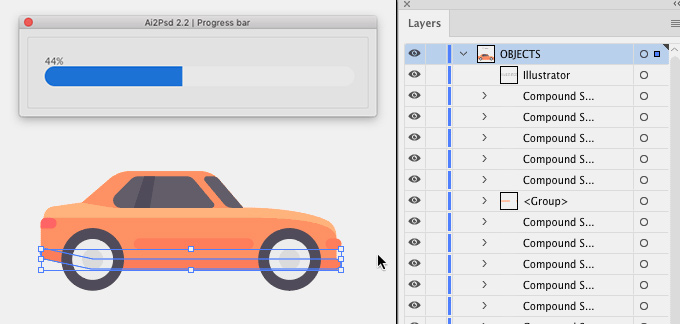

# Ai2Psd v2.2
  

## News
* Version 2.2 added progress bar and timer.
* Version 2.1 fixed unlock and order of objects issue.  
* Version 2.0 of the script doesn't need to load the helper Action file. If you have any of previous versions, you may delete 'Ai-to-Psd' set from `Windows → Actions` right after upgrade.

## Description
The script may help to prepare vector layers for export from AI to PSD file.  
All `solid filled` objects remain vector in the PSD.

## Installation 

1. [Download archive] and unzip
2. Place `Ai2Psd.jsx` in the Illustrator Scripts folder:
	- OS X: `/Applications/Adobe Illustrator [vers.]/Presets.localized/en_GB/Scripts`
	- Windows (32 bit): `C:\Program Files (x86)\Adobe\Adobe Illustrator [vers.]\Presets\en_GB\Scripts\`
	- Windows (64 bit): `C:\Program Files\Adobe\Adobe Illustrator [vers.] (64 Bit)\Presets\en_GB\Scripts\`
3. Restart Illustrator

[Download archive]: https://github.com/creold/ai-to-psd/archive/master.zip 

## Usage 

If you want to save the vector stroke in the PSD, then you have to select the object and use `Object → Path → Outline Stroke`. 

If you have a large group of small objects, e.g. hair brush draws, fur or outlined text, it'd be better to combine such elements into the `Compound Path with Object → Compound Path → Make` before the script is executed. 

1. Open document in Adobe Illustrator
2. Choose `File → Scripts → ai-to-psd`
3. Wait for the message of completion
4. Export the file to PSD via `File → Export → Export As...`

*Attention: Meshes, objects with a gradient fill, pattern, various strokes, Open Path can not be left as vectors after the export, but they are automatically grouped to be separate raster layers in the PSD.*

###Progress bar in v2.2   

## System Requirements

Should work with Adobe Illustrator CS6 and above.   
The script has been tested on Illustrator CS6 (Win), Illustrator CC 2017 (Mac OS High Sierra).

## Release notes 

| Version | Notes |
| --- | --- |
| **v2.2** | Added progress bar and timer. |
| **v2.1** | Fixed unlock and order of objects issue. |
| **v2.0** | The script doesn't need to load the helper Action file. |
| **v1.3** | Fixed Overprint issue. |
| **v1.2** | Improved preformance. |
| **v1.1** | The script unlocks visible layers & objects before and the do the rest. |
| **v1.0** | Initial Version. | 

## Contribute

This plugin is in active development.  
Found a bug? Please [submit a new issues](https://github.com/creold/ai-to-psd/issues) on GitHub.

## Donate (optional)
If you find this plugin helpful, consider shouting me juice ☕️ via [PayPal] or [Yandex Money] 🙂  

[PayPal]: https://paypal.me/osokin/2usd
[Yandex Money]: https://money.yandex.ru/to/410011149615582

### Contact
Email <hi@sergosokin.ru>  

### Co-author
Radmir Kashaev: [GitHub](https://github.com/rkashaev)  

### License

Ai-to-Psd is licensed under the MIT licence.  
See the included LICENSE file for more details.